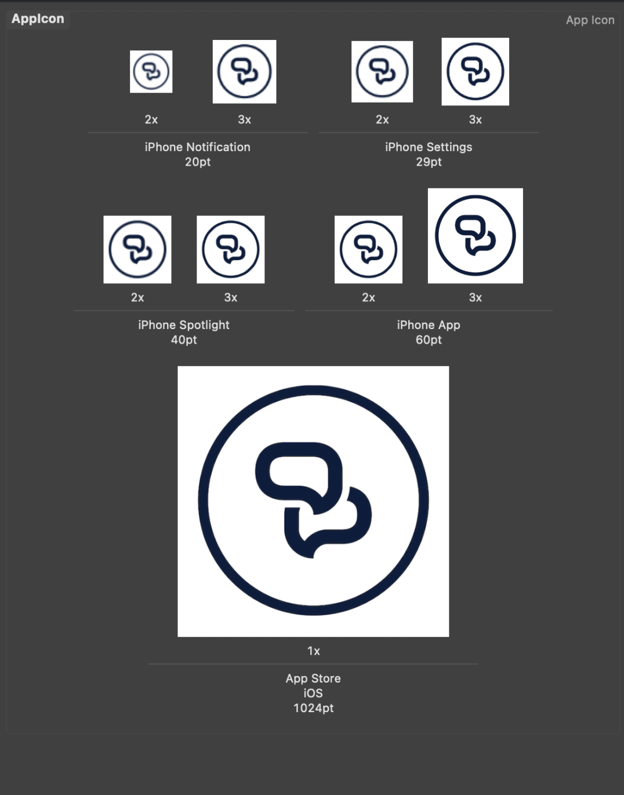

# PentiaProject
This is a simple chat application that includes login functionality and the possibility to join some predefined chat
rooms.

The app was developed using Google Firebase, React Native CLI for the framework & TypeScript as the main Programming Language. 

# Requirements

### Splash Screen - Accepttest:
- [x] As a user I would like a nice and clean splash screen while the application loads.
- [x] Splash loads while the application is loading up.  
- [x] When finish next screen should fade in. 
- [x] A. If you are logged in, go to Chat rooms
- [x] B. If you are not logged in, go to Login screen
 
### Login screen - Accepttest:
- [x] As a user I would like to be able to login using my social login accounts.
- [x] A. Facebook
- [x] B. Google

### Chat rooms - Accepttest:
- [x] As a user I would like to be shown a list of available rooms. The list is sorted by newest message.
- [x] A list is shown with the name and a short description of each room.
- [x] Each row have a chevron icon to the right indicating i can press.
- [x] The list is sorted by newest message. 
- [x] I can pull to refresh to reload the list.
- [x] Pressing a room takes me to the send and receive screen

### Send and receive messages - Accepttest:
- [x] As a user I would like to be able to send and receive messages inside a chat room.
- [x] Last 50 messages is loaded when chat room is opened.
- [x] Scroll to load more messages. 
- [x] When a message is received it is automatically added to the list. 
- [x] An input field at the bottom of the view should be shown. 
- [x] A. When pressed the keyboard opens.
- [x] B. When message entered and user presses “Send” / “Enter” the message is sent and added to the list.
- [x] A message consists of: Avatar of sender, Name of sender, Message date & Message text. 

### Push functionality - Accepttest:
- [x] As a user I would like to receive a push message when a new message is added to a room that I have participated in.
- [x] When i write a message inside a room, then i am asked if i want to have notifications from that room. 
- [x] Every time someone writes a message in the room, a push message is sent to me. 
- [x] When the user presses a push message, he or she should be taken directly to the room/message (using deep links).

### Upload of images to chat room - Accepttest:
- [x] As a user I would like to be able to upload an image to a chat room.
- [x] I can upload image from camera.  
- [x] I can upload image from phone gallery. 
- [x] Image is shown in the chat room in the same flow as messages. 

# Screenshots

### App Icons:

### MarketWatch

### Graph

### StockNews

### Search

### Watchlist

### Setting

